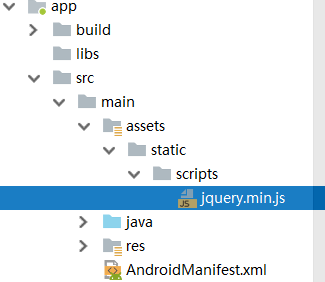

# CacheWebView

[](https://bintray.com/yale8848/maven/CacheWebView/2.1.8)

  [English](https://github.com/yale8848/CacheWebView/blob/master/README_EN.md)

  CacheWebView通过拦截资源实现自定义缓存静态资源。突破WebView缓存空间限制，让缓存更简单。让网站离线也能正常访问。

## 为什么要用CacheWebView

- 让WebView缓存空间更大
- 强制缓存静态资源，这样会更快
- 想方便的拿到web缓存资源，比如说从缓存中拿页面已经加载过的图片


## 使用方式

### 引入库

**注意2.x.x 不兼容 1.x.x**

```groovy
compile 'ren.yale.android:cachewebviewlib:2.1.8'
```

### 修改代码

Application 里初始化

```

    WebViewCacheInterceptorInst.getInstance().
                init(new WebViewCacheInterceptor.Builder(this));

```


给WebView添加拦截

- 如果你的项目minSdkVersion>=21

```
    mWebView.setWebViewClient(new WebViewClient(){

            @TargetApi(Build.VERSION_CODES.LOLLIPOP)
            @Nullable
            @Override
            public WebResourceResponse shouldInterceptRequest(WebView view, WebResourceRequest request) {
                return  WebViewCacheInterceptorInst.getInstance().interceptRequest(request);
            }

            @Nullable
            @Override
            public WebResourceResponse shouldInterceptRequest(WebView view, String url) {
                return  WebViewCacheInterceptorInst.getInstance().interceptRequest(url);
            }
     });

```

- 如果你的项目minSdkVersion<21

将调用 `mWebView.loadUrl(url)` 的地方替换为：`WebViewCacheInterceptorInst.getInstance().loadUrl(mWebView,url)`

```

    mWebView.setWebViewClient(new WebViewClient(){


            @TargetApi(Build.VERSION_CODES.LOLLIPOP)
            @Override
            public boolean shouldOverrideUrlLoading(WebView view, WebResourceRequest request) {
                WebViewCacheInterceptorInst.getInstance().loadUrl(mWebView,request.getUrl().toString());
                return true;
            }

            @Override
            public boolean shouldOverrideUrlLoading(WebView view, String url) {
                WebViewCacheInterceptorInst.getInstance().loadUrl(mWebView,url);
                return true;
            }

            @TargetApi(Build.VERSION_CODES.LOLLIPOP)
            @Nullable
            @Override
            public WebResourceResponse shouldInterceptRequest(WebView view, WebResourceRequest request) {
                return  WebViewCacheInterceptorInst.getInstance().interceptRequest(request);
            }

            @Nullable
            @Override
            public WebResourceResponse shouldInterceptRequest(WebView view, String url) {
                return  WebViewCacheInterceptorInst.getInstance().interceptRequest(url);
            }
    });

```

以上就配置完毕，其他代码不用改，这样拥有默认100M缓存空间；如果你需要更详细的配置，可以看看下面的进阶设置；

---

- 腾讯X5内核WebView兼容处理


```
     mWebView.setWebViewClient(new WebViewClient() {

            @Override
            public WebResourceResponse shouldInterceptRequest(WebView webView, String s) {
                return WebResourceResponseAdapter.adapter(WebViewCacheInterceptorInst.getInstance().
                        interceptRequest(s));
            }

            @Override
            public WebResourceResponse shouldInterceptRequest(WebView webView, WebResourceRequest webResourceRequest) {

                return WebResourceResponseAdapter.adapter(WebViewCacheInterceptorInst.getInstance().
                        interceptRequest(WebResourceRequestAdapter.adapter(webResourceRequest)));
            }
        });

```

下面是兼容代码，可以参考：

```
@TargetApi(Build.VERSION_CODES.LOLLIPOP)
public class WebResourceRequestAdapter implements android.webkit.WebResourceRequest {

    private com.tencent.smtt.export.external.interfaces.WebResourceRequest mWebResourceRequest;

    private WebResourceRequestAdapter(com.tencent.smtt.export.external.interfaces.WebResourceRequest x5Request){
        mWebResourceRequest = x5Request;
    }

    public static WebResourceRequestAdapter adapter(com.tencent.smtt.export.external.interfaces.WebResourceRequest x5Request){
        return new WebResourceRequestAdapter(x5Request);
    }

    @Override
    public Uri getUrl() {
        return mWebResourceRequest.getUrl();
    }

    @Override
    public boolean isForMainFrame() {
        return mWebResourceRequest.isForMainFrame();
    }

    @Override
    public boolean isRedirect() {
        return mWebResourceRequest.isRedirect();
    }

    @Override
    public boolean hasGesture() {
        return mWebResourceRequest.hasGesture();
    }

    @Override
    public String getMethod() {
        return mWebResourceRequest.getMethod();
    }

    @Override
    public Map<String, String> getRequestHeaders() {
        return mWebResourceRequest.getRequestHeaders();
    }
}

```


```
public class WebResourceResponseAdapter extends com.tencent.smtt.export.external.interfaces.WebResourceResponse {

    private android.webkit.WebResourceResponse mWebResourceResponse;

    private WebResourceResponseAdapter(android.webkit.WebResourceResponse webResourceResponse){
        mWebResourceResponse = webResourceResponse;
    }

    public static WebResourceResponseAdapter adapter(android.webkit.WebResourceResponse webResourceResponse){
        if (webResourceResponse == null){
            return null;
        }
        return new WebResourceResponseAdapter(webResourceResponse);

    }

    @Override
    public String getMimeType() {
        return mWebResourceResponse.getMimeType();
    }

    @Override
    public InputStream getData() {
        return mWebResourceResponse.getData();
    }

    @RequiresApi(api = Build.VERSION_CODES.LOLLIPOP)
    @Override
    public int getStatusCode() {
        return mWebResourceResponse.getStatusCode();
    }

    @RequiresApi(Build.VERSION_CODES.LOLLIPOP)
    @Override
    public Map<String, String> getResponseHeaders() {
        return mWebResourceResponse.getResponseHeaders();
    }

    @Override
    public String getEncoding() {
        return mWebResourceResponse.getEncoding();
    }

    @RequiresApi(Build.VERSION_CODES.LOLLIPOP)
    @Override
    public String getReasonPhrase() {
        return mWebResourceResponse.getReasonPhrase();
    }
}


```

如果你的项目minSdkVersion<21, 在 `mWebView.loadUrl(url)` 之后调用  `WebViewCacheInterceptorInst.getInstance().loadUrl(url,mWebView.getSettings().getUserAgentString())`;


---

### 进阶设置

 - 基本设置

 ```Java
    WebViewCacheInterceptor.Builder builder =  new WebViewCacheInterceptor.Builder(this);

     builder.setCachePath(new File(this.getCacheDir(),"cache_path_name"))//设置缓存路径，默认getCacheDir，名称CacheWebViewCache
                        .setCacheSize(1024*1024*100)//设置缓存大小，默认100M
                        .setConnectTimeoutSecond(20)//设置http请求链接超时，默认20秒
                        .setReadTimeoutSecond(20)//设置http请求链接读取超时，默认20秒
                        .setCacheType(CacheType.NORMAL);//设置缓存为正常模式，默认模式为强制缓存静态资源

     WebViewCacheInterceptorInst.getInstance().init(builder);
 ```

- 设置缓存后缀

CacheWebview通过后缀判断来缓存静态文件，可以添加删除

```Java
    WebViewCacheInterceptor.Builder builder =  new WebViewCacheInterceptor.Builder(this);

    CacheExtensionConfig extension = new CacheExtensionConfig();
    extension.addExtension("json").removeExtension("swf");//添加删除缓存后缀

    builder.setCacheExtensionConfig(extension);

    WebViewCacheInterceptorInst.getInstance().init(builder);
```

默认有以下后缀缓存

```
    private static HashSet STATIC = new HashSet() {
        {
            add("html");
            add("htm");
            add("js");
            add("ico");
            add("css");
            add("png");
            add("jpg");
            add("jpeg");
            add("gif");
            add("bmp");
            add("ttf");
            add("woff");
            add("woff2");
            add("otf");
            add("eot");
            add("svg");
            add("xml");
            add("swf");
            add("txt");
            add("text");
            add("conf");
            add("webp");
        }
    };

```

默认有以下后缀不缓存

```
    private static HashSet NO_CACH = new HashSet() {
        {
            add("mp4");
            add("mp3");
            add("ogg");
            add("avi");
            add("wmv");
            add("flv");
            add("rmvb");
            add("3gp");
        }
    };
```

- 设置Assets路径

CacheWebview可以从Assets路径加载静态资源，只要设置了Assets路径就是开启此功能，默认未开启；

```

  
    WebViewCacheInterceptor.Builder builder =  new WebViewCacheInterceptor.Builder(this);
    //默认精确匹配地址规则
    builder.setAssetsDir("static");
    
    //后缀匹配规则
    //builder.isAssetsSuffixMod(true);
    //WebViewCacheInterceptorInst.getInstance().initAssetsData(); //后台线程获取Assets文件资源
    
    WebViewCacheInterceptorInst.getInstance().init(builder);

```

builder.setAssetsDir("static")后匹配规则：

assets 结构如下：



（1）默认精确匹配规则：那么只有满足这种结构的url：http://xxx.com/scripts/jquery.min.js 都会从assets获取资源

（2）后缀匹配规则：那么只要满足这种结构的url：http://xxx.com/x/xx/scripts/jquery.min.js 都会从assets获取资源

- 自定义拦截规则

```
    builder.setResourceInterceptor(new ResourceInterceptor() {
            @Override
            public boolean interceptor(String url) {
                return true;//按照默认规则，false 不拦截资源
            }
        });
```


- 获取缓存文件

```

    String url = "http://m.mm131.com/css/at.js";
    InputStream inputStream =  WebViewCacheInterceptorInst.getInstance().getCacheFile(url);
    if (inputStream!=null){

    }

```

- 清除缓存文件

```
    WebViewCacheInterceptorInst.getInstance().clearCache();
```

- 强制缓存失效

  强制缓存失效后，由WebView正常加载资源

```
    WebViewCacheInterceptorInst.getInstance().enableForce(false);
```

- HostnameVerifier设置

 builder.setTrustAllHostname();不安全

```
    WebViewCacheInterceptor.Builder builder =  new WebViewCacheInterceptor.Builder(this);
    builder.setTrustAllHostname();//HostnameVerifier不验证，HostnameVerifier.verify()返回true，默认正常验证
    WebViewCacheInterceptorInst.getInstance().init(builder);

```

- SSLSocketFactory 设置

```
    WebViewCacheInterceptor.Builder builder =  new WebViewCacheInterceptor.Builder(this);
    builder.setSSLSocketFactory(SSLSocketFactory sslSocketFactory, X509TrustManager trustManager);//自定义SSLSocketFactory和X509TrustManager
    WebViewCacheInterceptorInst.getInstance().init(builder);

```

- Debug log

默认开启debug log , TAG="CacheWebView",可以关闭log

```
    WebViewCacheInterceptor.Builder builder =  new WebViewCacheInterceptor.Builder(this);
    builder.setDebug(false);
    WebViewCacheInterceptorInst.getInstance().init(builder);

```


- 非单例模式

**调用方法和单例一样**

```
    WebViewCacheInterceptor.Builder builder =  new WebViewCacheInterceptor.Builder(this);
    WebViewRequestInterceptor webViewRequestInterceptor = builder.build();
    webViewRequestInterceptor.getCacheFile("");
```

## 混淆

```
#CacheWebview
-dontwarn ren.yale.android.cachewebviewlib.**
-keep class ren.yale.android.cachewebviewlib.**{*;}

#okhttp
-dontwarn okhttp3.**
-keep class okhttp3.**{*;}

#okio
-dontwarn okio.**
-keep class okio.**{*;}
```


## 贡献

   [如何贡献代码](https://github.com/yale8848/CacheWebView/blob/master/CONTRIBUTING.md)

### 博客

  [如何让Android WebView访问更快](https://my.oschina.net/yale8848/blog/1544298)
